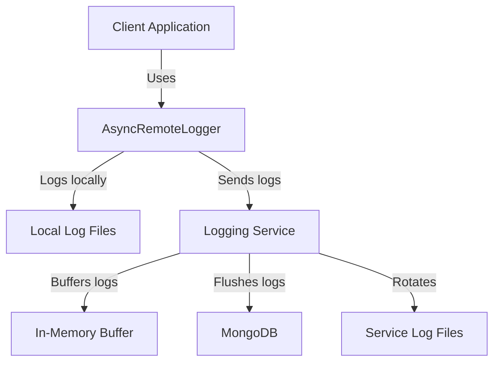

# Buffered Async Logger

## Table of Contents
1. [Overview](#1-overview)
2. [System Architecture](#2-system-architecture)
3. [Components](#3-components)
4. [Installation & Deployment](#4-installation--deployment)
5. [Configuration](#5-configuration)
6. [Usage](#6-usage)
7. [API Reference](#7-api-reference)
8. [Security Considerations](#8-security-considerations)
9. [Monitoring & Logging](#9-monitoring--logging)
10. [Troubleshooting](#10-troubleshooting)
11. [Development Guide](#11-development-guide)
12. [Maintenance & Operations](#12-maintenance--operations)

### 1. Overview

Buffered Async Logger is a robust, asynchronous logging system designed to provide efficient and reliable logging capabilities for distributed applications. It consists of two main components: a client-side logger and a server-side logging service. The system offers both local file-based logging and remote logging to a MongoDB database, ensuring data persistence and easy retrieval.

Key features:
- Asynchronous logging operations
- Buffered writes to reduce network overhead
- Local file logging with automatic rotation and cleanup
- Remote logging to a MongoDB database
- Support for multiple log levels (DEBUG, INFO, WARNING, ERROR, CRITICAL)
- Singleton pattern implementation for the client-side logger
- FastAPI-based logging service with health check endpoint

The BufferedAsyncLogger is ideal for applications that require high-performance logging capabilities, especially in distributed or microservices architectures.

### 2. System Architecture

The BufferedAsyncLogger system consists of two main components:

1. **Client-side Logger (AsyncRemoteLogger)**:
   - Implemented in `logger.py`
   - Provides both synchronous and asynchronous logging methods
   - Handles local file logging and remote logging to the logging service

2. **Server-side Logging Service**:
   - Implemented in `main.py`
   - FastAPI-based service that receives log messages from clients
   - Buffers log messages and periodically flushes them to MongoDB
   - Manages a capped collection in MongoDB for efficient log storage



### 3. Components

#### 3.1 AsyncRemoteLogger (Client-side)

**Purpose**: Provides a simple interface for applications to log messages both locally and remotely.

**Core Functionality**:
- Local file logging with automatic rotation
- Remote logging to the logging service
- Asynchronous and synchronous logging methods
- Singleton pattern implementation

**Technologies Used**:
- Python 3.10+
- asyncio
- httpx for asynchronous HTTP requests
- logging module for local file logging

**Interactions**:
- Interacts with the local file system for file-based logging
- Communicates with the Logging Service via HTTP POST requests

#### 3.2 Logging Service (Server-side)

**Purpose**: Receives log messages from clients, buffers them, and periodically flushes them to MongoDB.

**Core Functionality**:
- FastAPI-based HTTP server
- In-memory buffering of log messages
- Periodic flushing of logs to MongoDB
- Automatic creation and management of a capped collection in MongoDB
- Periodic cleanup of old log files

**Technologies Used**:
- Python 3.10+
- FastAPI
- uvicorn for ASGI server
- Motor for asynchronous MongoDB operations
- python-dotenv for environment variable management

**Interactions**:
- Receives HTTP POST requests from AsyncRemoteLogger clients
- Interacts with MongoDB for log storage
- Manages local log files for the service itself

### 4. Installation & Deployment

#### Prerequisites
- Python 3.10 or higher
- Docker (for containerized deployment)
- MongoDB instance (for the logging service)

#### Environment Setup

1. Clone the repository:
   ```
   git clone https://github.com/your-repo/BufferedAsyncLogger.git
   cd BufferedAsyncLogger
   ```

2. Set up a virtual environment (optional but recommended):
   ```
   python -m venv venv
   source venv/bin/activate  # On Windows, use `venv\Scripts\activate`
   ```

3. Install dependencies:
   ```
   pip install -r logger/requirements.txt
   ```

#### Deployment

1. Configure the environment variables:
   - Copy `logger/sample.env` to `logger/.env`
   - Edit `logger/.env` and set the `MONGODB_URI` to your MongoDB connection string

2. Build the Docker image:
   ```
   ./build-images.ksh
   ```

3. Deploy using Docker Compose:
   ```
   docker-compose up -d
   ```

This will start the logging service on port 8181.

### 5. Configuration

#### Environment Variables

The logging service uses the following environment variables:

- `MONGODB_URI`: MongoDB connection string
- `FLUSH_INTERVAL`: Interval (in seconds) for flushing logs to MongoDB (default: 60)
- `DELETE_LOGS_OLDER_THAN`: Number of days to keep log files before deletion (default: 30)

These can be set in the `.env` file or passed as environment variables when running the container.

#### MongoDB Configuration

The logging service automatically creates a capped collection in MongoDB with the following settings:

- Database Name: `event_logs`
- Collection Name: `logs`
- Capped Collection Size: 1GB
- Maximum Documents: 100,000

### 6. Usage

#### Using AsyncRemoteLogger in Your Application

1. Import the AsyncRemoteLogger:
   ```python
   from logger import AsyncRemoteLogger
   ```

2. Initialize the logger:
   ```python
   logger = AsyncRemoteLogger("http://logging-service:8181", "YourAppName")
   ```

3. Use the logger in your application:
   ```python
   # Asynchronous logging
   await logger.ainfo("This is an info message")
   await logger.aerror("This is an error message")

   # Synchronous logging
   logger.info("This is a synchronous info message")
   logger.error("This is a synchronous error message")
   ```

4. Close the logger when your application shuts down:
   ```python
   await logger.aclose()  # or logger.close() for synchronous
   ```

### 7. API Reference

#### Logging Service Endpoints

##### POST /log

Logs a message to the service.

Request Body:
```json
{
  "level": "string",
  "message": "string",
  "app_name": "string"
}
```

Response:
```json
{
  "status": "success",
  "message": "Log recorded"
}
```

##### GET /

Health check endpoint.

Response:
```json
{
  "status": "Logging service is running..."
}
```

#### AsyncRemoteLogger Methods

- `alog(level: str, message: str)`: Asynchronously log a message with the specified level
- `ainfo(message: str)`: Asynchronously log an info message
- `adebug(message: str)`: Asynchronously log a debug message
- `awarning(message: str)`: Asynchronously log a warning message
- `aerror(message: str)`: Asynchronously log an error message
- `acritical(message: str)`: Asynchronously log a critical message
- `aprint(*args, sep=" ", end="\n")`: Asynchronously log a message like print()
- `aclose()`: Asynchronously close the logger

Synchronous versions of these methods are also available without the 'a' prefix.

### 8. Security Considerations

- Ensure that the `MONGODB_URI` is kept secret and not exposed in logs or error messages.
- Use HTTPS for the logging service in production environments.
- Implement authentication for the logging service API if deployed in a non-trusted network.
- Regularly update dependencies to patch any security vulnerabilities.

### 9. Monitoring & Logging

- The logging service itself logs to a file named `BufferedLogging.log` in the `logs` directory.
- Monitor the MongoDB collection size and document count to ensure it stays within limits.
- Use MongoDB's built-in monitoring tools to track the performance of log insertions.

### 10. Troubleshooting

Common issues and solutions:

1. **Logs not appearing in MongoDB**:
   - Check the `MONGODB_URI` is correct
   - Ensure the logging service has network access to MongoDB
   - Check the logging service logs for any connection errors

2. **High memory usage on the logging service**:
   - Decrease the `FLUSH_INTERVAL` to write logs to MongoDB more frequently
   - Increase the server resources if the log volume is consistently high

3. **Slow log insertion**:
   - Check MongoDB performance and consider scaling the database
   - Increase the `FLUSH_INTERVAL` to batch more logs per write operation

### 11. Development Guide

- The codebase is organized into two main components: `logger.py` for the client-side logger and `main.py` for the logging service.
- Use `black` for code formatting and `flake8` for linting.
- Write unit tests for new features and ensure all tests pass before submitting pull requests.
- Follow the existing code style and docstring conventions.

### 12. Maintenance & Operations

- Regularly check and rotate the service's own log files in the `logs` directory.
- Monitor the MongoDB capped collection size and adjust if necessary.
- Periodically review and update the `DELETE_LOGS_OLDER_THAN` setting based on log retention requirements.
- Keep the Python dependencies updated, especially for security patches.
- Regularly backup the MongoDB database containing the logs.

By following this documentation, you should be able to effectively deploy, use, and maintain the BufferedAsyncLogger system. For any additional questions or issues, please refer to the project's issue tracker or contact the maintainers.